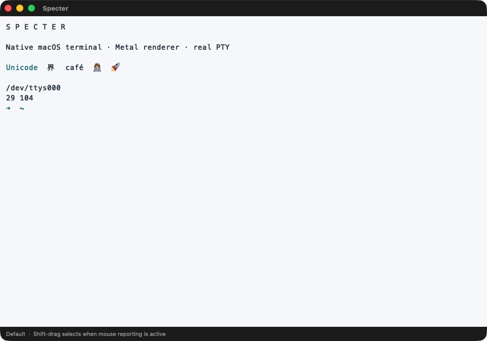
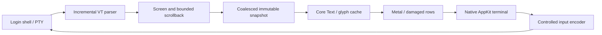
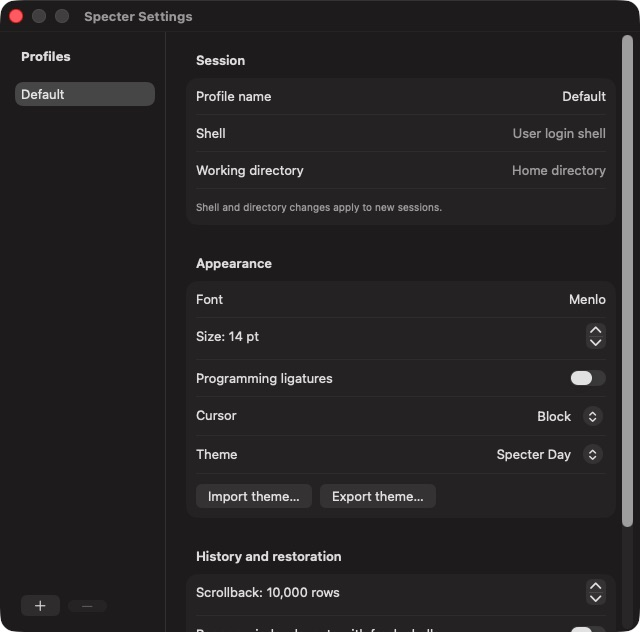

<div align="center">

# S P E C T E R

**A native macOS terminal, drawn with Metal.**

Swift · AppKit · Core Text · POSIX PTYs

Development preview · macOS 14+ target · Apple silicon · MIT

</div>



Specter runs your login shell in a real pseudoterminal. Its Swift terminal engine parses bytes independently of the interface, Core Text handles glyphs and font fallback, and Metal draws the grid. Native tabs, split panes and keyboard workflows keep the terminal central.

This is a working development build, not a claim of complete terminal compatibility or production readiness. Runtime validation currently covers an M3 MacBook Air on macOS 26.3.1. See [compatibility and limitations](docs/compatibility.md) before relying on it for daily work.

## What works

- Interactive login shells, resize propagation, foreground interruption and child cleanup.
- Primary and alternate screens, scroll regions, text attributes, ANSI/256/RGB colors, Unicode 17 grapheme segmentation and emoji rendering.
- Bounded scrollback, primary-screen reflow, selection, copy/paste and search across wrapped lines.
- Native windows and tabs, horizontal or vertical split panes, profiles, fonts and cursor styles.
- Ten original themes and validated JSON import/export.
- IME composition, AppKit text accessibility, reduced-motion/high-contrast handling and explicit Secure Keyboard Entry.
- Sanitized hyperlinks, protected paste, optional background bell notifications and explicit file previews.
- Opt-in metadata restoration with fresh shells; local performance report export.

No server, account, cloud database, analytics or external AI service is required. Terminal output is not persisted.

## Build and run

Use Xcode 26.3 / Swift 6.2.4 or a compatible Swift 6 toolchain with the macOS SDK and Metal tools installed. The deployment target is macOS 14. Source compatibility with older toolchains has not been tested.

```sh
./scripts/build-app.sh
open .build/Specter.app
```

The script builds the Swift modules and C helper, compiles the bundled terminfo and creates a locally ad-hoc-signed app. It does not distribute, notarize or use Developer ID signing.

For Xcode, open `Specter.xcodeproj` and select the Specter scheme. `project.yml` is the project source; regenerate it with `xcodegen generate` after changing project structure. The command-line build does not require XcodeGen.

## Keyboard workflow

| Action | Shortcut |
|---|---|
| New window / tab | ⌘N / ⌘T |
| Split right / below | ⌘D / ⇧⌘D |
| Close pane or last-pane window | ⌘W |
| Next pane | Control-Tab |
| Previous / next tab | ⇧⌘[ / ⇧⌘] |
| Copy / paste / select all | ⌘C / ⌘V / ⌘A |
| Find / next match | ⌘F / ⌘G |
| Settings | ⌘, |

Hold Shift while selecting in an application that has enabled mouse reporting. Command-click a hyperlink to review its destination before opening it. Multiline/control-bearing paste requires confirmation.

## Architecture



`TerminalCore` has no UI or GPU dependency. A serial session queue owns parsing and PTY I/O. A standalone C helper establishes the controlling terminal, watches the application lifetime and reaps the shell. A bounded mailbox coalesces render snapshots without dropping terminal bytes. The renderer updates damaged rows in a persistent texture and presents a complete frame to every drawable.

Read [architecture decisions](docs/architecture.md), [terminal compatibility](docs/compatibility.md), and the [security policy](SECURITY.md).

## Configuration and themes

Profiles live in the app's local preferences. Shell and working-directory changes apply to new sessions. Appearance changes apply to existing sessions using that profile. Empty shell/directory fields select the account's login shell and home directory.



Themes use schema version 1: `id`, `name`, `background`, `foreground`, `cursor`, `selection`, sixteen `palette` colors and `isDark`. Colors are `#RRGGBB`. Use Settings to export a valid example. Imports are capped at 64 KiB, validated and cannot overwrite a bundled theme ID. The bundled themes are original; no third-party palette collection is included.

Restoration is off by default. Enabling it saves window geometry, tab groups, split direction and profile IDs, then starts fresh shells on launch. It does not restore shell processes, command history, terminal output or inferred working directories. Splits currently use a single axis per window and do not restore divider ratios.

## Tests and measurements

```sh
./scripts/check.sh
swift run -c release SpecterBench
swift run -c release SpecterBench --fuzz 600
swift run -c release SpecterBench --million
```

The suite covers parser fragmentation and malformed input, state transitions, the official Unicode 17 grapheme test corpus, PTY resize/exit, 100 lifecycle cycles, native hit testing/IME composition, Metal snapshots and damaged-row rendering. `scripts/lifecycle-probe.py` exercises application-side SIGKILL cleanup after building its small probe library as described in [validation](docs/validation.md).

The Shell menu can export a local performance report containing frame-encoding timings, event-to-presentation samples and atlas counters. It contains no commands or terminal output. These software measurements exclude physical keyboard and display latency.

See [reproducible measurements and test evidence](docs/validation.md). No unmeasured throughput, latency or comparative performance claims are made here.

## Roadmap

- Broader VT conformance, alternate-screen resize coverage and additional full-screen applications.
- Spoken VoiceOver review, more input methods, external displays and macOS 14/15 runtime coverage.
- Full keypad/modern keyboard protocols, arbitrary nested splits and divider-ratio restoration.
- Complex-script shaping expansion and measured performance optimization.
- Optional local AI assistance only after terminal reliability is established. Email integration remains a separate, opt-in idea outside the terminal MVP.

## Contributing and acknowledgements

Read [CONTRIBUTING.md](CONTRIBUTING.md) and [AGENTS.md](AGENTS.md). Use synthetic fixtures and truthful runtime evidence. Never publish private terminal content.

Apple's AppKit, MetalKit, Core Text and POSIX documentation informed the implementation. The xterm control-sequence reference and Unicode 17 data define the tested behavior. Unicode data is redistributed under its [license](docs/Unicode-LICENSE.txt).

Ghostty is a behavioral reference; no Ghostty source code or identity is included. OpenCode, Cursor and Raycast informed the preference for clear typography and keyboard workflows. The reviewed michaelshimeles/skills guidance informed module separation and evidence discipline; Greptile and automatic publishing workflows are excluded. Mobbin reference browsing was unavailable during the initial research.

Specter source is licensed under [MIT](LICENSE).
