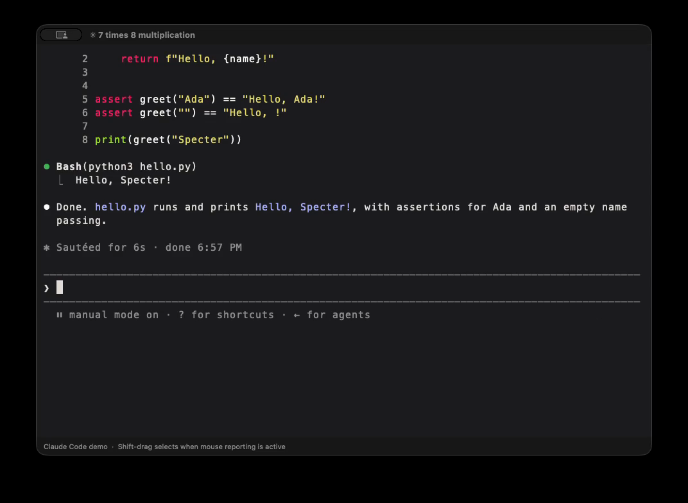

# Claude Code + DeepSeek in Specter

Specter successfully ran Claude Code with the configured DeepSeek V4 Pro endpoint, answered a question, created a Python file, and executed it. The independent shell check printed `Hello, Specter!` and returned exit status `0` on a real `/dev/ttys…` PTY.

This verifies a small, specific workflow. It does not establish that every Claude Code feature, provider, Mac, or terminal application works.

## Watch the real terminal recording

[Watch or download the recorded verification](media/claude-deepseek-demo.mp4)

[](media/claude-deepseek-demo.mp4)

The video runs for three minutes at normal speed. Approximate points: launch and model warning at the start, answer at 0:35, generated file at 1:00, command approval through 2:10, successful execution at 2:25, and independent shell verification at the end. Pauses include operator review time, not just model response time.

The recording shows the native Specter window, not the website illustration. It includes the launch command, the DeepSeek model name, both prompts, file and command approvals, generated code, and an independent execution in the shell. Capture and encoding details are recorded below. No synthetic terminal UI or model response was composited into the recording.

## Try it yourself

1. [Build and install Specter](install.md).
2. Install Claude Code using its [official setup instructions](https://code.claude.com/docs/en/setup). Check `claude --version` in Specter.
3. Configure your own DeepSeek account and API key using [DeepSeek’s Claude Code integration guide](https://api-docs.deepseek.com/quick_start/agent_integrations/claude_code/). Claude Code and DeepSeek are separate services; Specter does not supply credentials or API access.
4. Start in an empty test folder. The recorded model ID was `deepseek-v4-pro`; provider IDs and mappings can change, so check the provider guide for current availability.

For an already configured shell, the command used in this test was:

```sh
claude --safe-mode --model deepseek-v4-pro
```

Safe mode disables custom plugins, hooks, MCP servers, and personal instructions for a reproducible test. It keeps the ordinary permission prompts. We approved only the displayed file creation and the displayed Python execution, without disabling permission checks.

The provider environment used `ANTHROPIC_BASE_URL=https://api.deepseek.com/anthropic` and an existing `ANTHROPIC_AUTH_TOKEN`. Keep your token out of screenshots, Git, shell history, and shared transcripts. Follow the provider setup instructions privately before recording your own demo.

Ask:

> What is 7 times 8? Reply with the answer and one short sentence explaining what a terminal does.

Then ask:

> Create hello.py here: greet(name) returns Hello, NAME! Add assertions for Ada and an empty name, then print greet("Specter"). Run python3 hello.py. Use only this folder, no dependencies.

Review the proposed file and command before approving. The generated file in the recorded test was:

```python
def greet(name):
    return f"Hello, {name}!"


assert greet("Ada") == "Hello, Ada!"
assert greet("") == "Hello, !"

print(greet("Specter"))
```

Exit Claude Code with `/exit` and independently check the file:

```sh
cat hello.py
python3 hello.py
echo "Exit status: $?"
tty
```

Expected output includes `Hello, Specter!`, `Exit status: 0`, and a PTY path. The assertions cover a normal name and an empty string; they are a small smoke test, not a comprehensive application test suite.

## Environment and observed limitations

- Specter source revision: `b686970`; native executable built from that revision. An isolated copy used a separate bundle ID, profile, clean shell, empty workspace, and Claude configuration directory so the demo did not expose personal shell startup output or existing sessions.
- Host: Apple silicon M3 Mac, macOS 26.3.1. Claude Code: `2.1.259`. Python: `3.14.6`. Provider hostname: `api.deepseek.com`. Requested model: `deepseek-v4-pro`. This is the configured endpoint and CLI-reported model, not an independent attestation of the provider’s internal routing.
- Claude Code warned that the model was absent from its built-in catalog and applied a 200k context assumption. This short test did not exercise context limits.
- On the recorded repeat, Claude Code reported a previous fullscreen renderer startup failure and automatically selected its classic renderer. That warning is left visible. The successful result therefore does not certify the fullscreen renderer. `/tui default` is the fallback suggested by that version of Claude Code.
- Both the initial test and the recorded repeat were performed through Specter’s real PTY. The initial recording was interrupted before the capture tool finalized its output; the published recording is a fresh timed repeat, not a reconstruction.
- The machine briefly ran low on disk space. Only an agent-created temporary debug build cache was removed. No terminal engine code was changed for the demo.
- Specter itself has no integrated AI service. Claude Code was explicitly launched as an external terminal program and used the user’s existing DeepSeek setup.

## Recording provenance

macOS `screencapture` recorded only the isolated Specter window for 180 seconds with audio disabled. The timed recording was allowed to finalize normally. Raw media stays under `.artifacts/` locally; the reviewed MP4 is the public artifact. Encoding changes the container/codec settings for playback without speeding up events or replacing terminal content.

The MP4 is H.264, 1072 × 784, 30 fps, 180 seconds, and 1,600,676 bytes. The source recording was 60 fps; the export samples it at 30 fps while preserving elapsed time. All decoded frames passed an FFmpeg error check; a contact sheet and full-size outcome frames were reviewed for content and scope. The terminal window is the only captured surface, with no audio, credentials, personal sessions, or other applications included. Rapidly typed shell input briefly overlaps program output near the end; this is left visible in the uncut recording.

SHA-256: `5e34407f0e7a198b024bdecb9989a5dcc91d07ad5a787881347b7dd285434fd6`.

## Checks for this PR

`scripts/check.sh` passed formatting, all 30 tests in six suites (2.007 seconds), C static analysis, and the release app build (13.31 seconds). These durations describe this local check run, not terminal performance. `python3 scripts/check-website.py` passed the existing routes, 13 chapters, and 130 matching app/web/download themes. `ffmpeg -v error -i docs/media/claude-deepseek-demo.mp4 -f null -` decoded the full recording without errors.

This PR adds evidence and documentation rather than changing application code. No claim of broader platform or fullscreen-renderer certification is made.
